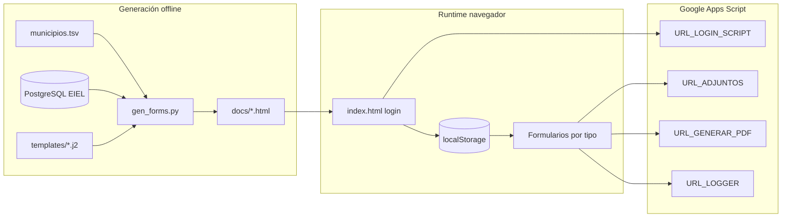

# Informe de análisis del proyecto EIEL

**Repositorio:** `cguillen-gn/eiel-prototipo`  
**Organización funcional:** Geonet Territorial | Diputación de Alicante  
**Fecha del análisis:** 31 de julio de 2026  
**Rama analizada:** `main` (`dd27180`)  
**Fase generada en distribución:** EIEL 2026  

---

## 1. Resumen ejecutivo

El proyecto es un **portal estático de formularios** para que técnicos municipales de la provincia de Alicante validen y actualicen datos de la **EIEL** (Encuesta de Infraestructuras y Equipamientos Locales).

Su arquitectura es híbrida:

| Capa | Tecnología | Rol |
|------|------------|-----|
| Generación | Python 3 + Jinja2 + PostgreSQL | Extrae datos EIEL y produce HTML por municipio |
| Distribución | Carpeta `docs/` + GitHub Pages | Sirve el portal sin servidor de aplicación |
| Backend operativo | Google Apps Script | Login, adjuntos, PDF/justificante y logging |
| Cliente | HTML/CSS/JS + Lucide (+ Tailwind solo en index) | UX de acceso, formularios y envío |

En la distribución actual hay **141 municipios**, **806 páginas HTML** (~66 MB) y **8 tipos de formulario** (4 siempre visibles + 4 condicionales).

---

## 2. Propósito y actores

- **Usuarios:** técnicos de ayuntamientos (acceso por municipio + código).
- **Gestores:** Geonet / Diputación (generan formularios desde BD, reciben envíos en Drive/Sheets vía Apps Script).
- **Objetivo:** recoger actualizaciones de infraestructuras y equipamientos por fase anual, con justificante PDF y adjuntos.

---

## 3. Estructura del repositorio

```text
eiel-prototipo/
├── gen_forms.py          # Motor de generación (Python)
├── generate.bat          # Build Windows: limpia HTML de docs/ y ejecuta gen_forms.py
├── .env / .env.example   # Credenciales DB + URLs Apps Script (.env no versionado)
├── .gitignore            # Solo ignora .env
├── README.md             # Documentación operativa
├── data/
│   └── municipios.tsv    # 141 municipios (código INE local + nombre)
├── templates/            # Fuentes Jinja2 (10 plantillas)
├── css/style.css         # Diseño fuente (~40 KB)
├── assets/favicon.ico
└── docs/                 # Artefacto público (GitHub Pages)
    ├── index.html
    ├── {tipo}_{código}.html   # 805 formularios
    ├── css/, assets/, img/
```

### Separación fuente / distribución

- **Fuente (raíz):** plantillas, CSS, datos, generador y secretos locales.
- **Distribución (`docs/`):** HTML ya renderizado con datos de BD y URLs de backend inyectadas.
- El README indica no editar `docs/` a mano: cualquier cambio debe regenerarse con `generate.bat` / `gen_forms.py`.

### Desajustes respecto al README

| Mención en README | Estado real |
|-------------------|-------------|
| Carpeta `js/` con `upload.js` | **No existe**; la lógica de subida está embebida en cada plantilla |
| Imports PIL/base64 en generador | Importados en `gen_forms.py` pero **no usados** |
| `ASSETS_JS_DIR` | Definido y no utilizado |

---

## 4. Flujo de funcionamiento



### 4.1 Pipeline de build

1. Carga `.env` (DB + 4 URLs de Apps Script).
2. Lee `data/municipios.tsv` y formatea nombres UI (`Adsubia`, `Montesinos (Los)` → `Los Montesinos`, etc.).
3. Conecta a PostgreSQL y obtiene `max(fase)` desde `geonet_fase` (actualmente **2026**).
4. Por cada municipio:
   - Genera siempre: **agua**, **obras**, **residuos**, **equipamientos**.
   - Genera bajo condición:
     - **cementerios** si hay cementerios en BD.
     - **alumbrado / viario / saneamiento** si hay avisos personalizados no recibidos para ese tipo.
5. Escribe `docs/index.html` con lista de municipios + mapa de flags JS.
6. Copia `css/` y `assets/` a `docs/`.

`generate.bat` borra previamente `docs/*.html` para evitar páginas huérfanas.

### 4.2 Runtime (usuario municipal)

1. Entra en `index.html`, elige municipio e introduce código.
2. Login POST a Apps Script (`URL_LOGIN_SCRIPT`); si `valid`, guarda sesión en `localStorage`.
3. Menú muestra formularios fijos + opcionales según flags del municipio.
4. Cada formulario exige sesión (`eiel_muni_code`); si falta, redirige al index.
5. Al enviar: valida → congela UI → sube adjuntos en Base64 → POST del payload → overlay de progreso / éxito (justificante por email vía Apps Script).
6. Logger silencioso registra apertura de página (excepto `file:`).

---

## 5. Formularios y cobertura actual

| Tipo | Generación | Páginas en `docs/` | Contenido principal |
|------|------------|-------------------:|---------------------|
| Agua | Siempre | 141 | Gestión del servicio, consumo anual, limpieza de depósitos |
| Obras | Siempre | 141 | Estado de obras filtradas + altas de obras no listadas |
| Residuos | Siempre | 141 | Fracciones selectivas (fase anterior) + limpieza viaria |
| Equipamientos | Siempre | 141 | Estado por categoría, edificios sin uso, nuevos equipamientos |
| Cementerios | Si hay datos | 118 | Matriz de ocupación (fosas, nichos, etc.) |
| Saneamiento | Si hay avisos | 74 | Gestión del servicio + respuesta a requerimientos |
| Alumbrado | Si hay avisos | 47 | Respuesta a avisos / adjuntos |
| Viario | Si hay avisos | 2 | Respuesta a avisos (solo 011 y 119) |
| Index | Único | 1 | Login + menú |

**Total:** 806 HTML.

Los avisos personalizados salen de `coordinador.solicitud_datos_formularios` (`recibido IS NOT TRUE`), ordenados por prioridad.

---

## 6. Motor de datos (`gen_forms.py`)

### Dependencias efectivas

- `jinja2`, `python-dotenv`, `psycopg2`
- `Pillow` aparece importado pero no se usa (código muerto / resto de una versión anterior)

No hay `requirements.txt` en el repositorio.

### Consultas relevantes

| Función | Origen | Notas |
|---------|--------|-------|
| `obtener_fase_actual` | `geonet_fase` | Fallback 2024 si vacío |
| `obtener_depositos` | `deposito` + `deposito_enc` | Solo titular `MU` |
| `obtener_obras` | `geonet_obras` | Filtros complejos (excluye AN, FI+RE, EATIM, DIIN, PAE, DICH salvo municipios en lista blanca) |
| `obtener_cementerios` | `cementerio` | Excluye titular `CR` excepto Benasau (`022`) |
| `obtener_equipamientos` | UNION de 11 capas | Fotos y mapa vía `visoreiel.geonet.es` |
| `obtener_avisos_personalizados` | `coordinador.solicitud_datos_formularios` | Condiciona 3 formularios |

### Variables de entorno

```text
DB_HOST, DB_PORT, DB_NAME, DB_USER, DB_PASSWORD
URL_ADJUNTOS, URL_GENERAR_PDF, URL_LOGIN_SCRIPT, URL_LOGGER
```

---

## 7. Capa de plantillas (frontend fuente)

### Herencia

```text
index-template.html.j2     → standalone (login)
base.html.j2               → layout común de formularios
  └── form-*.html.j2       → 8 tipos
```

Bloques de `base`: `title`, `bloque_fase`, `header_icon`, `header_title`, `content`, `scripts`.

### Capacidad compartida en `base.html.j2`

- `window.EIEL_CONFIG` (municipio, fase, URLs, avisos).
- Sesión / logout (`localStorage.clear()`).
- Autocompletado de contacto desde `localStorage`.
- `toggleFormFreeze` durante el envío.
- Aviso `beforeunload` si el formulario está “sucio”.
- Overlay de progreso.
- Logger de acceso (`no-cors`).
- Visor modal de imágenes (equipamientos).

### Bibliotecas externas

| Librería | Uso |
|----------|-----|
| Lucide (`unpkg @latest`) | Iconografía |
| SweetAlert2 | Cargado en base; **sin uso aparente** en plantillas |
| Tailwind CDN | Solo index (convive con CSS propio) |
| Google Fonts Inter | Tipografía |

### Patrón de envío (todos los formularios)

1. Validación (contacto, email confirmado sin paste, declaración jurada, reglas por tipo, avisos con texto o adjunto).
2. `UploadService`: FileReader → Base64 → POST a `urlAdjuntos` (`no-cors`), límite cliente 35 MB.
3. Identificador de lote `ENVIO_{timestamp}`.
4. POST JSON a `urlGenerarPdf` (`no-cors`) para persistencia + justificante.
5. UI congelada hasta éxito; mensaje de no cerrar la ventana.

---

## 8. Diseño visual

- Paleta base: azul Diputación (`#0080ad`) sobre fondo `#f0f8ff`.
- Temas por formulario (agua, obras, residuos, etc.) con color de acento propio.
- Contenedor máximo ~1000px; cards, tablas y acordeones para equipamientos.
- Responsive limitado: principalmente el grid de 2 columnas colapsa a ≤640px; tablas con scroll horizontal.
- Logos en `docs/img/` (Diputación + Geonet). Fotos de equipamientos no se empaquetan: se sirven desde el visor EIEL.

---

## 9. Seguridad y privacidad (modelo actual)

**Fortalezas**

- `.env` fuera de Git.
- Logout limpia `localStorage`.
- Freeze del formulario durante el envío.
- Confirmación de email con paste deshabilitado.
- Etiquetado de entorno de pruebas (`eiel_is_test` / prefijo `(PRUEBAS)`).

**Riesgos / limitaciones**

1. **Sesión solo en cliente:** conocer o forzar `eiel_muni_code` en `localStorage` abre el HTML estático; las URLs son predecibles (`agua_001.html`, …).
2. **`fetch` con `no-cors` en adjuntos/PDF:** no se puede comprobar el resultado real del backend; un fallo puede mostrarse como éxito aparente.
3. **URLs de Apps Script embebidas** en todos los HTML públicos de `docs/`.
4. **`isTest` se pierde** al reasignar `EIEL_CONFIG` en scripts de formulario (posible bug funcional).
5. **Sin `requirements.txt` ni pin de versiones** de dependencias Python / CDN (`lucide@latest`).
6. Auth por código municipal compartido (no identidad individual fuerte).

---

## 10. Observaciones técnicas y deuda

| Área | Hallazgo |
|------|----------|
| Documentación | README sólido; desactualizado respecto a `js/` |
| Código muerto | Imports PIL/base64/BytesIO; SweetAlert2 sin uso; `ASSETS_JS_DIR` |
| Duplicación | Lógica `UploadService` / `UIProgress` / validación repetida en cada `form-*.j2` |
| Index | Tailwind CDN + CSS propio mezclados |
| Tamaño de salida | Algunos `equipamientos_*.html` superan 1–2 MB (datos + URLs de foto/mapa inline) |
| HTML inválido | Alumbrado: cierre `</div>` donde debería ir `</li>` en avisos |
| Commits | Historial reciente con mensajes genéricos (`act`) |
| Build | `generate.bat` es Windows-only; no hay script equivalente `.sh` en el repo |
| Branches remotas | Existen líneas de refactor (`refact`, `refact_pro`, `fix_estructura_forms`, etc.) no integradas en este análisis de `main` |

---

## 11. Mapa de mantenimiento (operativo)

| Cambio deseado | Archivo | Después |
|----------------|---------|---------|
| URLs / DB | `.env` | Regenerar |
| UI / campos | `templates/*.j2` | Regenerar |
| Estilos | `css/style.css` | Regenerar (copia a `docs/css`) |
| Municipios | `data/municipios.tsv` | Regenerar |
| SQL / reglas de inclusión | `gen_forms.py` | Regenerar |
| Publicación | `git push` de `docs/` | GitHub Pages |

---

## 12. Conclusión

El prototipo cumple de forma clara su misión: **materializar por municipio formularios EIEL pre-rellenados desde PostgreSQL**, publicarlos como sitio estático y **canalizar respuestas y documentos hacia Google Apps Script**.

La arquitectura es pragmática y adecuada para un ciclo anual de recogida (regenerar → publicar → recoger), con buena separación entre secretos de generación y artefacto web. Los puntos más relevantes a vigilar son la **seguridad de sesión basada solo en `localStorage`**, la **opacidad de errores por `no-cors`**, la **duplicación de JS en plantillas** y el **tamaño/volumen** de la carpeta `docs/` regenerada.

---

## Anexo A — Inventario de plantillas

| Archivo | Salida |
|---------|--------|
| `index-template.html.j2` | `docs/index.html` |
| `base.html.j2` | (no se emite solo) |
| `form-agua.html.j2` | `agua_{code}.html` |
| `form-obras.html.j2` | `obras_{code}.html` |
| `form-residuos.html.j2` | `residuos_{code}.html` |
| `form-equipamientos.html.j2` | `equipamientos_{code}.html` |
| `form-cementerios.html.j2` | `cementerios_{code}.html` |
| `form-alumbrado.html.j2` | `alumbrado_{code}.html` |
| `form-viario.html.j2` | `viario_{code}.html` |
| `form-saneamiento.html.j2` | `saneamiento_{code}.html` |

## Anexo B — Claves de `localStorage`

| Clave | Uso |
|-------|-----|
| `eiel_muni_code` | Código municipio en sesión |
| `eiel_muni_name` | Nombre mostrado |
| `eiel_is_test` | Marca entorno de pruebas |
| `eiel_user_name` | Nombre del técnico |
| `eiel_user_email` | Email del técnico |
| `eiel_user_dept` | Departamento |

## Anexo C — Endpoints Apps Script

| Variable | Función |
|----------|---------|
| `URL_LOGIN_SCRIPT` | Validación municipio + código |
| `URL_ADJUNTOS` | Recepción de ficheros (Base64) |
| `URL_GENERAR_PDF` | Persistencia de respuestas + justificante |
| `URL_LOGGER` | Telemetría de acceso a formularios |
